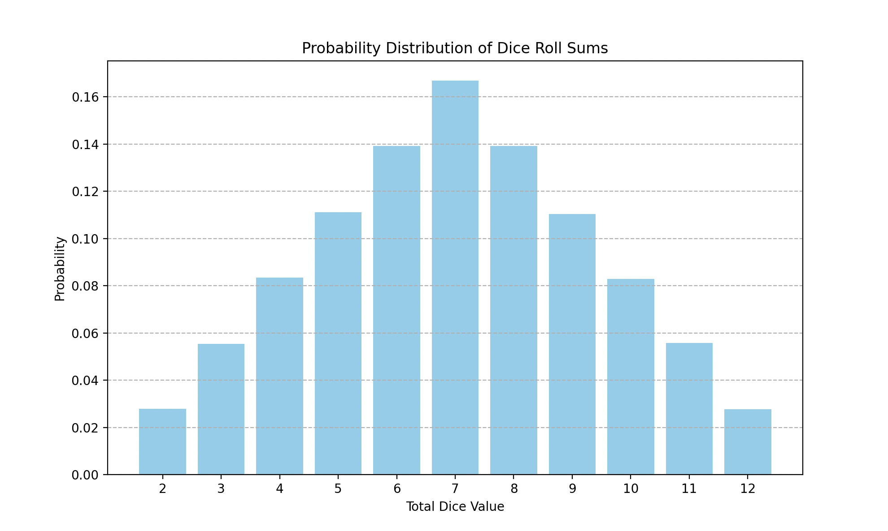

# Task 7: Використання методу Монте-Карло

## Результати експерименту



```
Сума | Практичні результати (%) | Аналітичний розв'язок (%)
-----|--------------------------|--------------------------
   2 |                     2.76 |                    2.78
   3 |                     5.60 |                    5.56
   4 |                     8.29 |                    8.33
   5 |                    11.16 |                   11.11
   6 |                    13.92 |                   13.89
   7 |                    16.59 |                   16.67
   8 |                    13.90 |                   13.89
   9 |                    11.12 |                   11.11
  10 |                     8.32 |                    8.33
  11 |                     5.57 |                    5.56
  12 |                     2.77 |                    2.78
```

## Висновки

Практичні результати методу Монте-Карло дуже близькі до аналітичних розрахунків, що підтверджує високу точність цього методу для обчислення ймовірностей. Крім того, сума всіх ймовірностей для можливих результатів також дорівнює 1 (або 100%), що демонструє правильність і повноту проведених обчислень. Це свідчить про ефективність методу Монте-Карло для моделювання випадкових процесів, таких як кидання кубиків.
